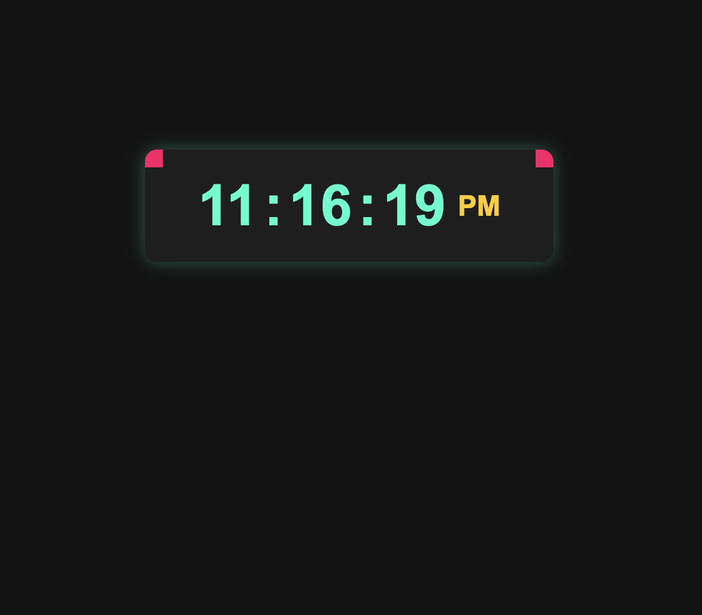

# ⏰ Day 14: Digital Clock with Stylish Design  

## 🚀 Project Overview  
In this project, we build a **modern digital clock** using **HTML, CSS, and JavaScript**. The clock dynamically updates every second, displays **AM/PM**, and features **hover effects with changing corner borders** to enhance the design.

---

## 🎨 Features  
✅ **Live Time Update:** The clock updates in real-time.  
✅ **AM/PM Indicator:** Displays whether it's AM or PM.  
✅ **Stylish Design:** A dark theme with a bold, colorful clock.  
✅ **Hover Effects:** The four corners change colors on hover.  

## 🛠️ Technologies Used  
- **HTML** – Structure of the clock  
- **CSS** – Styling, background, animations, and hover effects  
- **JavaScript** – Making the clock dynamic and updating every second  

---

# Demo page

Click [Here](https://ayshasanyang.github.io/Day-14-digital-clock-/) to view the page

## 🚀 How to Run
1. Download or clone the repository
```bash
git clone https://github.com/ayshasanyang/Day-14-digital-clock-.git
```
2. Navigate to the project folder.
3. Open the project files in your vscode or any code editor of your choice
4. Open the `index.html` file in your web browser.
---

## 📸 Preview
 

---

Made with ❤️ by [AYSHA] 🚀